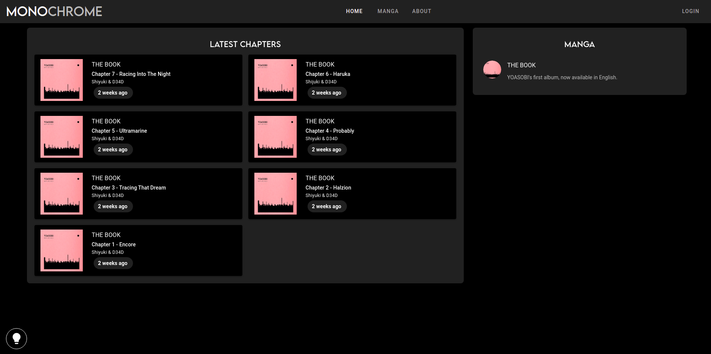
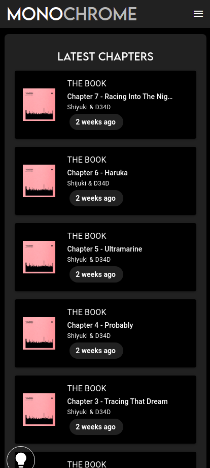
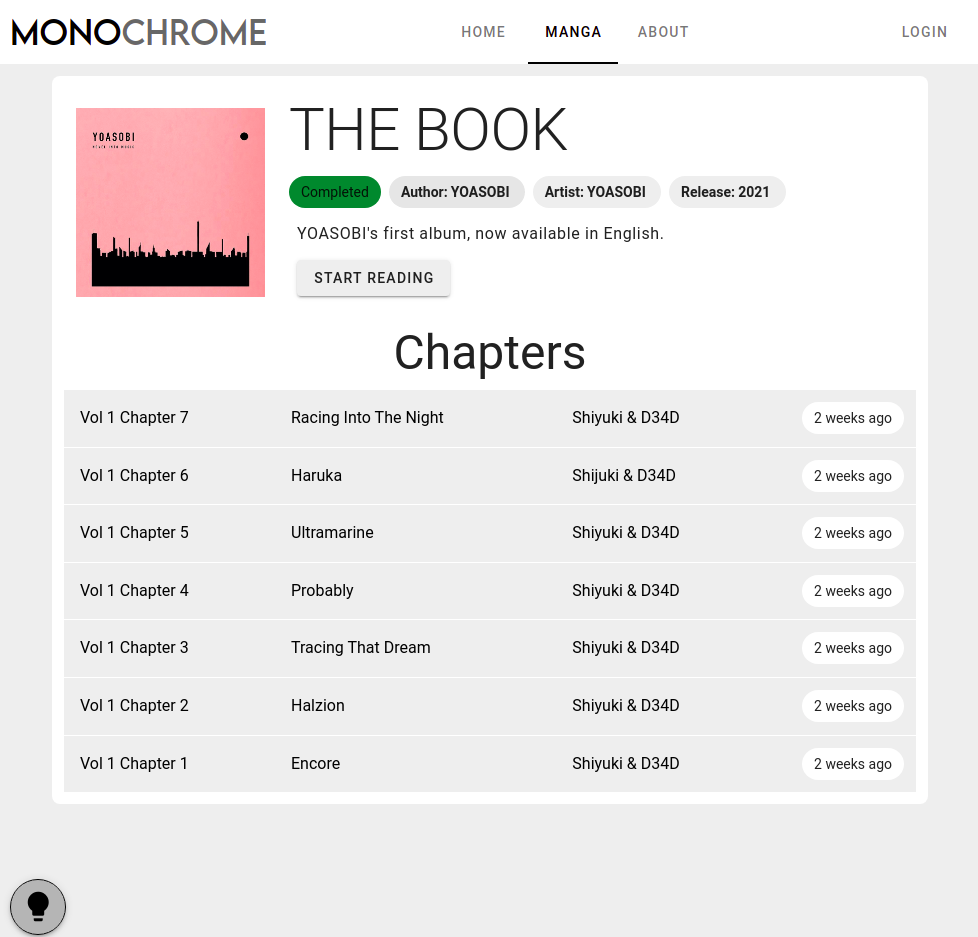
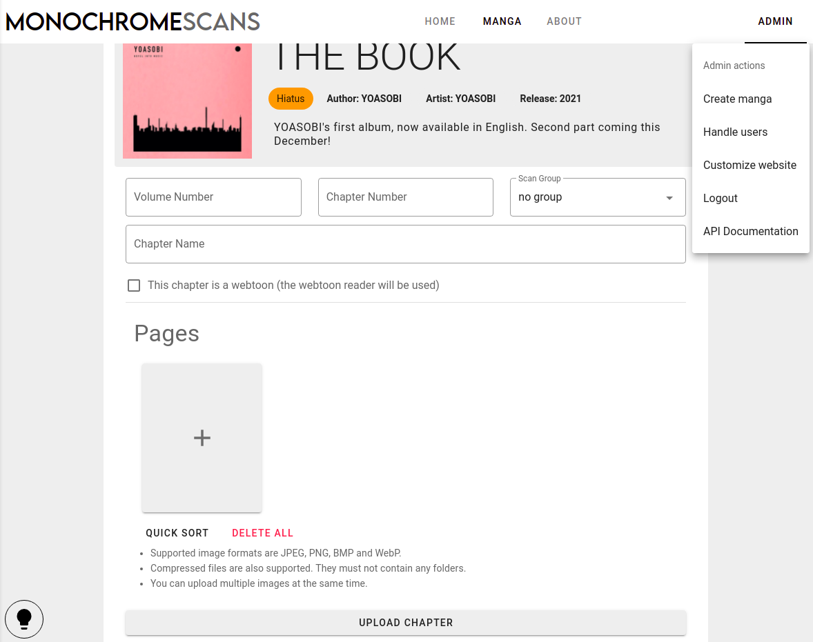
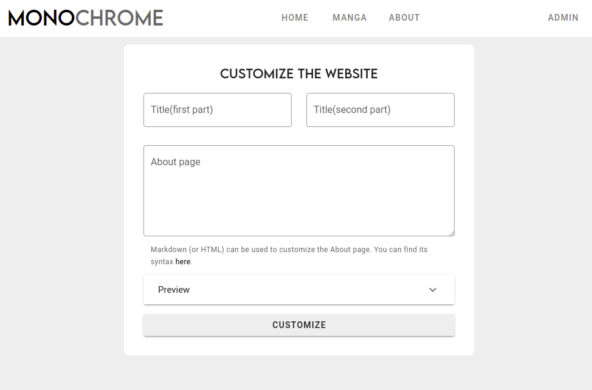
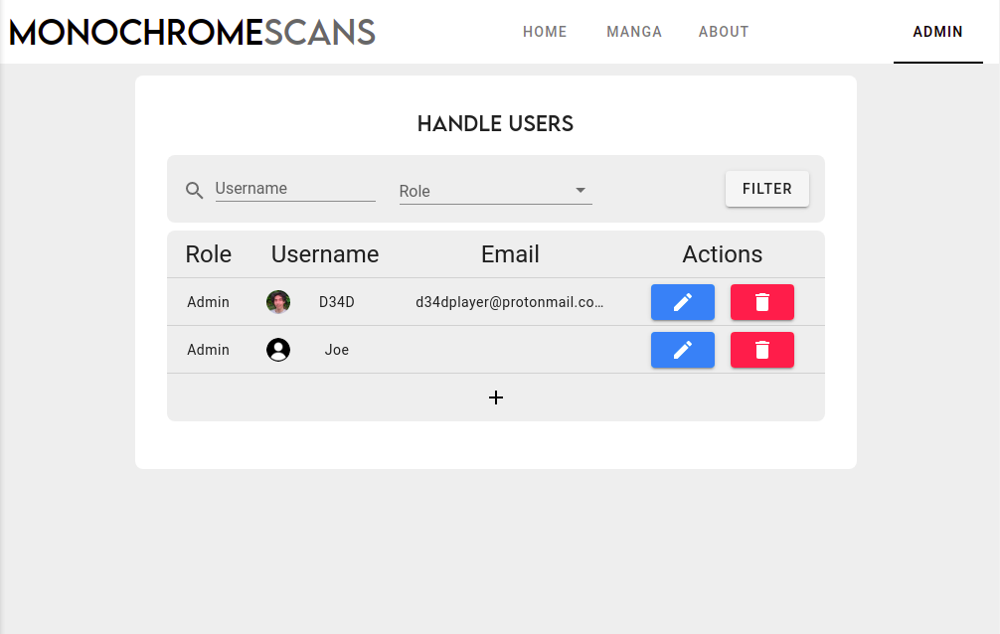
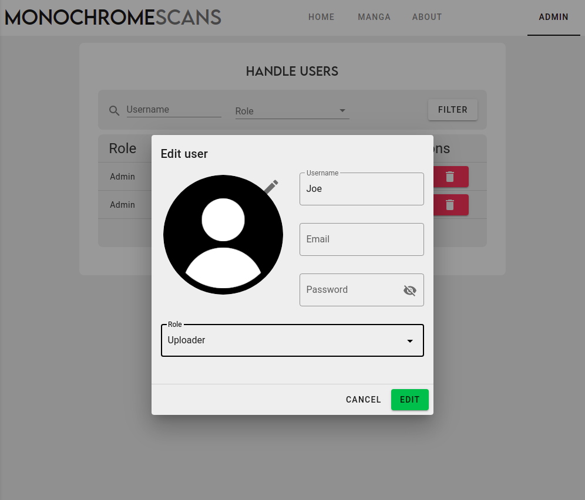

# Monochrome

 My attempt at a generic manga CMS

## Usage

Monochrome requires a copy of this repository,
[docker](https://docs.docker.com/engine/install/)
and [docker-compose](https://docs.docker.com/compose/install/) to run.

Once those requirements are fulfilled you need to set up your
[.env](#environment-settings) and simply run
`make install`, and the different services will be launched.

## Flavors

Two different "flavors" are available:

* `caddy` Includes PWA support, HTTPS (requires a domain name and to be the
  only web server on the machine), and optimisations, the one you most
  likely want. `make flavor=caddy install`
* `nginx` Same as production but without the HTTPS, in case you have other web
  servers and have a reverse proxy or want to handle the HTTPS yourself
  (ex. intranet). `make flavor=nginx install`

## Environment settings

Monochrome uses a `.env` file to take your settings,
an example is provided [here](.env.example).

### Variables

*Note: The database should be isolated by docker and only accessible by the
Monochrome API, however using unique username and password is very recommended.*

* `DB_NAME` Name for the database.
* `DB_USER` User to connect the database with.
* `DB_PWD` Password of that user.
* `SECRET_KEY` Secret used to encrypt the connections, change it asap.
* `SESSION_SECRET_KEY` Secret used to encrypt the session of the client,
  change it as well.

*Note: Those can and are recommended to be completely random, to generate them
you can use* `make secret`

* `PROTOCOL` `http` or `https`, if you use a flavor that doesn't handle HTTPS
  automatically, you'll still have to set it up on your own.
* `DOMAIN_NAME` The domain the app will be available on, ex: `manga.d34d.one`
  or `localhost`
* `TITLE` Name of your website, used for stuff like the title of the tab when
  you open the website.
* `DESCRIPTION` Description of your website.

* `DEFAULT_LANG` Default language.
* `LANGS` Comma separated list of available languages.

## Screenshots

### Home page



### Responsive layout



### Light and dark themes



### Chapter upload



### Website customization



### User management




## WebUI building

In case you want to compile the WebUI static files, you simply have to edit the
`.env.webui` file([details](https://github.com/MonochromeCMS/monochrome-webui#environment-variables))
and run `make build-webui`. This will create the static files inside a `./dist` folder.

## Cloud deployment

The motivation behind the Deta implementation was to have a stateless full stack
(the frontend being static already). This would allow us to to deploy Monochrome
on the cloud, potentially for free. If you want to go down this route here's a
not detailed list of the options you have to do so.

### Backend

All of this is possible because of Deta, which allows us to have a cloud
database and file storage for free. To use the deta version of the API you'll
need to create a Deta account and obtain a project key, that's all you need
for the API to work.

*Note: Deta is good, but if there's another free DB and file storage service
out there, the API could be implemented easily enough with those as well.*

### [Monochrome API](https://github.com/MonochromeCMS/monochrome-api)

The API is available as a docker image
[`ghcr.io/monochromecms/monochrome-api-deta:latest`](https://github.com/MonochromeCMS/monochrome-api/pkgs/container/monochrome-api),
so any service that allows us to run docker containers should be able to host
the API.

#### Deta Micros

Actually, the first option doesn't use the docker image, but it fits within the
Deta theme. You'll need `git` and [the Deta CLI](https://docs.deta.sh/docs/cli/install).

[](https://go.deta.dev/deploy?repo=https://github.com/MonochromeCMS/monochrome-api)

```bash
# If you want to go the Deta CLI route:
git clone https://github.com/MonochromeCMS/monochrome-api-deta
cd monochrome-api-deta

deta login
deta new .
deta deploy
deta auth disable
# Set up the .env file ex: https://github.com/MonochromeCMS/monochrome-api-deta/blob/main/.env.example
deta update -e .env
# A deta cron job is available to clean up the lingering upload sessions,
# more info: https://docs.deta.sh/docs/micros/cron
deta cron set "7 days"
```

You can then use the Deta UI to check the logs and the URL the API is hosted on.

*NOTE: Micros are limited to 128MB per execution, this can be a problem when
uploading big chapters, luckily an increase can be [requested](https://form.deta.dev/memory).*

#### Heroku

[](https://heroku.com/deploy?template=https://github.com/MonochromeCMS/monochrome-api)

#### Google Cloud Run

This one is harder but the one that gives the best performance for free:

* Create a Google Cloud free account (requires a credit card, but doesn't cost
  anything): https://cloud.google.com
* Copy the image from the GitHub registry into the Google registry:
  https://cloud.google.com/artifact-registry/docs/docker/pushing-and-pulling
* How to create a Cloud Run service:
  https://cloud.google.com/run/docs/deploying
*Details:*
* Set the container port to 3000
* 128Mb can be short sometimes, so 256Mb memory is recommended

### [Monochrome WebUI](https://github.com/MonochromeCMS/monochrome-webui)

The frontend is built into static files, either inside a container `make build`
or directly to a `dist` folder ([details](https://github.com/MonochromeCMS/Monochrome#webui-building)).
So we can either use the same providers as the API and CDNs.

#### Netlify

* Set up the .env.webui file
* Create a Netlify account
* Build the app with `make build-webui`
* Drag and drop the `dist` folder on the Netlify dashboard
* This will give you a Netlify URL, change it to your liking and update the
  .env.webui file to the new domain name.
* Build the app again and publish it again in Netlify.

### Examples

My production deployment is available on https://manga.d34d.one, it uses the
Postgres API inside a VPS.

A demo deployment is available on https://monochromecms.netlify.app, it uses
the Deta API inside Google Cloud Run and the website on Netlify.
You can test it out with the user `test:test`, please don't remove or edit
it to allow other users to test it out.

## Services used

Check those, for more information on the services that make up Monochrome:
* [Monochrome WebUI](https://github.com/MonochromeCMS/monochrome-webui)
* [Monochrome API](https://github.com/MonochromeCMS/monochrome-api)
  
Credits:
* Base API template: https://github.com/grillazz/fastapi-sqlalchemy-asyncpg
* Logo font: Lemon Milk by [Marsnev](https://marsnev.com/)
